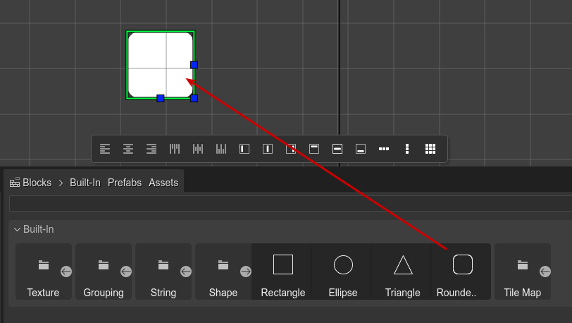
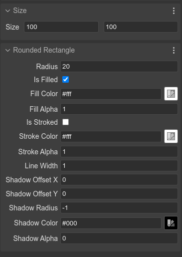
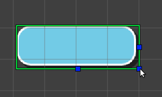
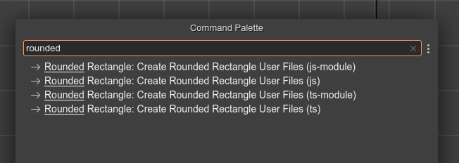
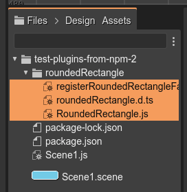

# Phaser Editor 2D v3 - SpineGameObject plugin

This repository contains SpineGameObject plugin for Phaser Editor 2D v3.

## Install

The plugin is distributed as a NodeJS package:

```bash
$ npm i --save-dev phasereditor2d-spinegameobject-plugin
```

It is important that you install the package as a development dependency (`--save-dev`), because Phaser Editor 2D only searches for plugins in that section. Also, the `package.json` file should be in the root of the project.

## Creating a SpineGameObject object

For creating a SpineGameObject object, you can drag the **SpineGameObject** type from the **Built-In** section of the **Blocks** view and drop it in the scene.

By default, it shows a white rectangle:



## SpineGameObject parameters  

A SpineGameObject object is similar to the Rectangle game object. It has size, background, stroke, in addition to specific properties, like radius, and shadow.

The shadow is part of the bound of the object, it means, if you increase the shadow offset, the background of the object decreases.



There are other properties common to the RenderTexture object, like those in the sections Transform, Origin, Visible, etc...

## Size manipulators

You can resize the SpineGameObject object with the **Size Tool**. Press the `Z` key or select this tool in the context menu **Tools** > **Resize Tool**.



## Code generation

The SpineGameObject object is not available in the Phaser built-in API. Phaser Editor 2D uses an internal implementation of this object, and provides the source code of a SpineGameObject game object that you can use in your project.

To get the source code of the SpineGameObject game object, execute the command **Create Spine Game Object User Files**:



You can open the Command Palette in the main menu or by pressing the `Ctrl+K` keys.

Look you there are four different commands:

* For creating JavaScript files as ES modules.
* For creating simple JavaScript files.
* For creating TypeScript files as ES modules.
* For creating simple TypeScript files.

These commands create a series of files with the source code of the SpineGameObject object. The files are copied in the folder selected in the **Files** view.



The files are following:

### `SpineGameObject.ts`
 
Contains the implementation of the SpineGameObject game object.

You can create a new instance like this:

```javascript
const obj = new SpineGameObject(scene, 10, 10, 100, 100);
scene.add.existing(obj);
```

### `registerSpineGameObjectFactory.ts`

Contains the `registerSpineGameObjectFactory()` function. 

You should use it for registering a `GameObjectFactory` method. It allows you creating new SpineGameObject objects like this: 

```javascript
const obj = this.add.spineGameObject(10, 10, 100, 100);
```
Before, you need to register the factory:

```javascript

const game = new Phaser.Game(...);
...
registerSpineGameObjectFactory();
...
```

### `spineGameObject.d.ts`

Contains the TypeScript definitions. Maybe you should move it to the `types` folder of your project. Or you should configure the `tsconfig.json` file finding the definitions.

### Code customization

You are free to change the code of the generated SpineGameObject files, however, take in consideration that the scene's code generated by the editor uses always the same public interface of the SpineGameObject object.
